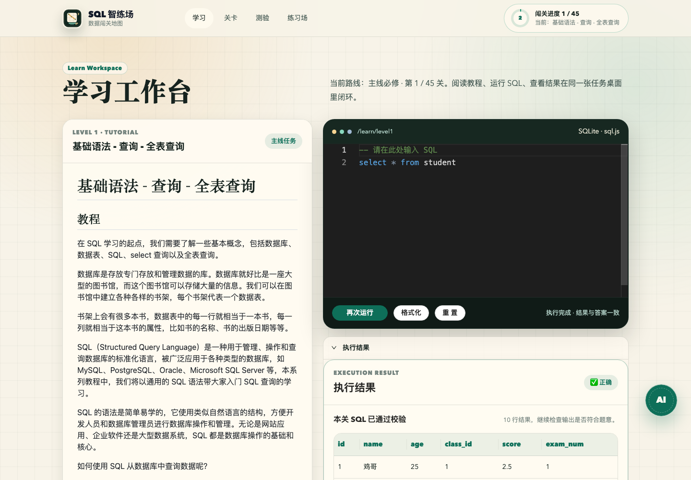
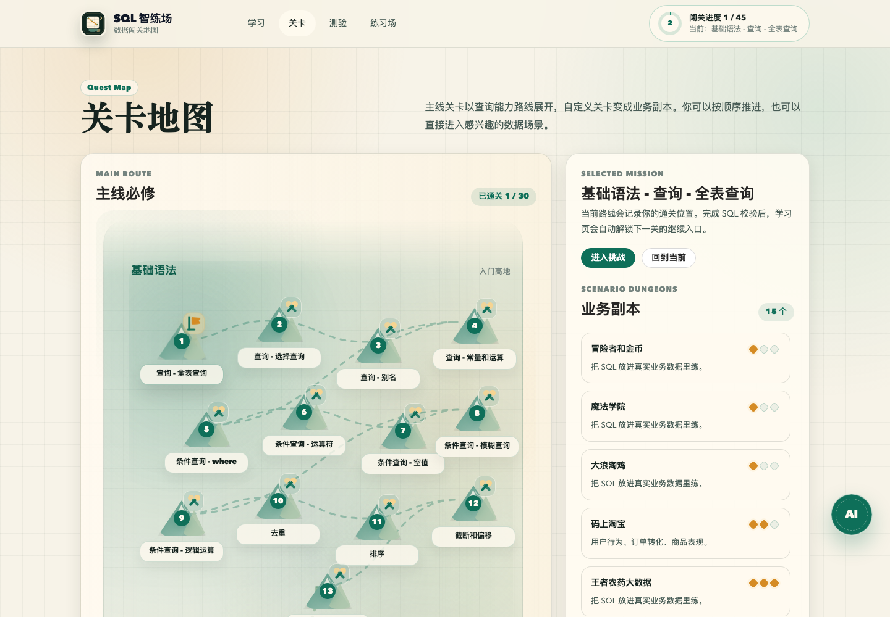
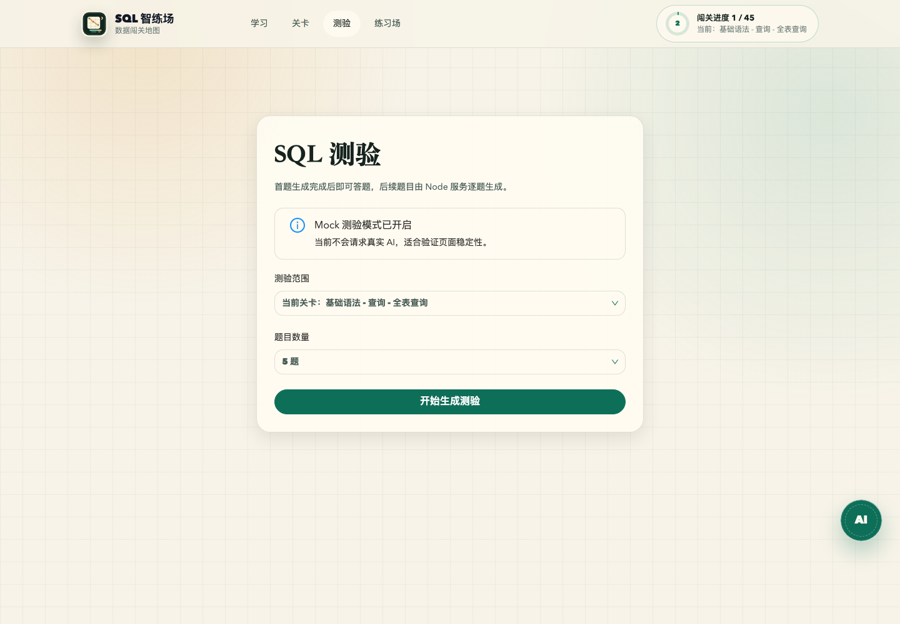
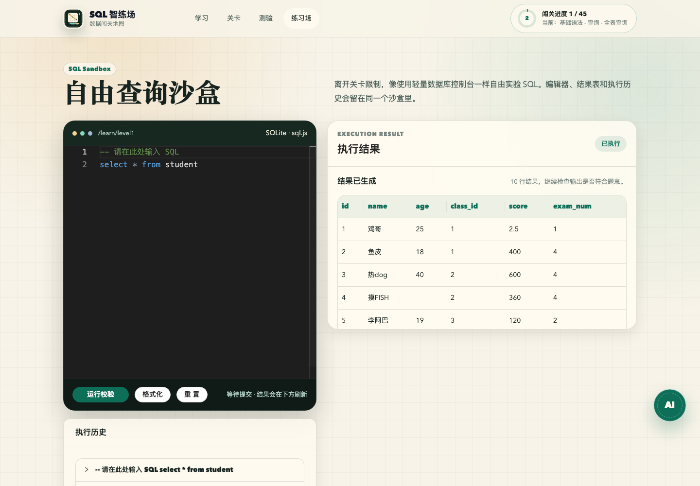

# SQL Mother AI

AI 辅助的闯关式 SQL 自学平台。项目把 SQL 学习拆成关卡、业务副本、自由练习和 AI 测验四个场景，让学习者可以在浏览器里阅读教程、编写 SQL、运行校验、复盘反馈，并用 AI 生成题目继续练习。

本项目基于 [liyupi/sql-mother](https://github.com/liyupi/sql-mother) 二次开发，感谢原作者 [程序员鱼皮](https://github.com/liyupi) 开源的基础项目。当前仓库不是原项目的官方版本，而是在原有闯关式 SQL 学习体验上加入 AI 辅助、测验服务和新的学习界面。

## 项目截图

### 学习工作台

教程、SQL 编辑器、运行结果在同一屏完成闭环，适合边读边练。



### 关卡地图

主线关卡按 SQL 能力路线组织，自定义关卡以业务副本形式展示。



### AI 测验

根据当前关卡或已通关范围生成测验，支持题目数量选择和 Mock 模式验证。



### 自由查询沙盒

脱离关卡限制自由执行 SQL，并保留执行历史与结果。



## 核心能力

- 闯关式 SQL 学习：内置主线关卡和自定义业务关卡，覆盖查询、条件、排序、聚合、连接等常用 SQL 训练。
- 浏览器内 SQL 执行：基于 `sql.js` 在前端执行 SQLite 语句，不需要本地安装数据库。
- 自动判题：执行用户 SQL 和参考 SQL，对比字段与结果集，正确后记录通关进度。
- AI 学习搭子：浮动 AI 面板会读取当前关卡上下文，辅助解释题目、分析思路和回答 SQL 问题。
- AI 配置中心：支持 OpenAI 兼容接口、Anthropic 接口和自定义 Provider，可配置 Base URL、接口路径、模型名和 API Key。
- AI 测验服务：Node 本地服务逐题生成 SQL 测验，支持当前关卡和已通关关卡范围。
- 自由练习场：提供轻量 SQL 沙盒，可自由输入 SQL、查看结果和执行历史。
- 学习进度持久化：通过 Pinia 和本地存储记录当前关卡、已通关关卡和 AI 配置状态。

## 本地运行

环境要求：

- Node.js 18 或更高版本
- npm

安装依赖：

```bash
npm install
```

启动完整开发环境：

```bash
npm run dev
```

该命令会同时启动：

- Vite 前端服务
- AI 测验 Node 服务

如果只需要前端页面：

```bash
npm run dev:client
```

如果需要单独启动 AI 测验服务：

```bash
npm run dev:quiz-server
```

构建生产包：

```bash
npm run build
```

## AI 配置

首次进入项目时，点击右下角 `AI` 浮动按钮或配置弹窗，填写模型服务信息。

支持的接口类型：

- OpenAI 兼容接口，例如 DeepSeek、OpenAI、通义千问兼容网关、本地兼容服务等
- Anthropic 接口
- 自定义 Provider，可填写自定义接口路径

配置保存到项目根目录的 `local-ai-config.json`，该文件已加入 `.gitignore`，不会提交到仓库。

调试 AI 测验页面时，可以使用 Mock 模式，不请求真实模型：

```bash
AI_QUIZ_MOCK=1 npm run dev
```

如默认端口被占用，可指定测验服务端口：

```bash
AI_QUIZ_MOCK=1 AI_QUIZ_PORT=6174 npm run dev
```

## 技术栈

- Vue 3
- Vue Router
- TypeScript
- Vite
- ant-design-vue
- Pinia + pinia-plugin-persistedstate
- monaco-editor
- sql.js
- sql-formatter
- bytemd + github-markdown-css
- markdown-it
- Node.js HTTP 服务
- Server-Sent Events

## 项目结构

```text
.
├── doc/screenshots              # README 页面截图
├── public                       # 静态资源和 sql.js wasm
├── scripts/dev.mjs              # 同时启动前端和测验服务
├── server/quiz-sse-server.mjs   # AI 测验与配置服务
├── src
│   ├── components               # 通用组件、SQL 编辑器、AI 面板和配置弹窗
│   ├── composables/useAI.ts     # AI 请求、流式响应和上下文构造
│   ├── configs/routes.ts        # 页面路由
│   ├── core                     # SQL 执行、判题和全局状态
│   ├── levels                   # 主线关卡和自定义业务关卡
│   └── pages                    # 学习、关卡、测验、练习场页面
├── vite.config.ts               # Vite 配置与开发期 AI 代理
└── package.json
```

## 页面说明

- `/#/learn`：学习工作台，展示关卡教程、SQL 编辑器和执行结果。
- `/#/levels`：关卡地图，按主线任务和业务副本选择练习内容。
- `/#/quiz`：AI 测验，根据当前学习进度生成 SQL 题目。
- `/#/playground`：自由查询沙盒，用于独立实验 SQL。

## 开发说明

新增关卡时，优先放入 `src/levels/custom`，让它成为一个独立业务副本。每个关卡目录通常包含：

- `README.md`：题目说明和教程内容
- `createTable.sql`：初始化表结构和数据
- `index.ts`：关卡标题、默认 SQL、参考答案、提示和难度配置

AI 相关能力分为两层：

- 前端通过 `src/composables/useAI.ts` 构造当前关卡上下文，并调用本地接口。
- 本地 Node 服务负责保存配置、转发模型请求、生成测验题，并通过 SSE 推送题目生成进度。

## 项目来源

本仓库基于 [liyupi/sql-mother](https://github.com/liyupi/sql-mother) 二次开发。原项目提供了 SQL 闯关学习的核心思路、关卡组织方式和前端 SQL 执行基础。本项目在此基础上重做了界面体验，并增加 AI 配置、AI 问答、AI 测验、学习进度和本地服务能力。

如需了解原始项目，请访问：

- 原项目仓库：[liyupi/sql-mother](https://github.com/liyupi/sql-mother)
- 原作者主页：[程序员鱼皮](https://github.com/liyupi)
